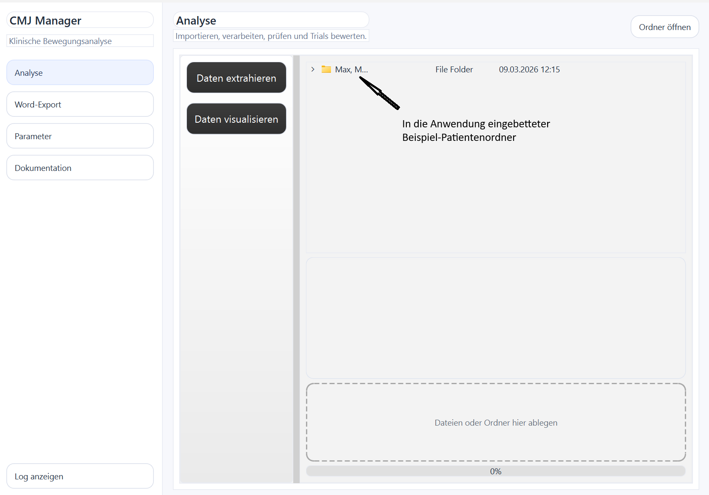
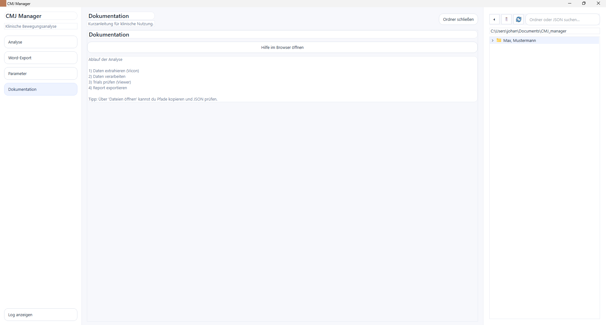
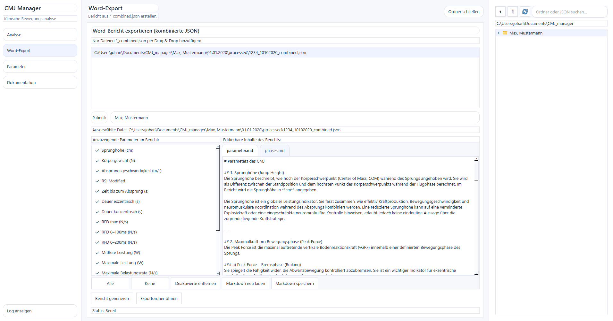

# CMJ Framework

### Countermovement Jump Biomechanical Analysis Tool

CMJ Framework is a Python software tool designed for the automated analysis of countermovement jump (CMJ) data.

The framework processes force plate and motion capture signals, detects biomechanical phases, computes performance metrics, and generates structured reports.

It was developed to support research and clinical biomechanics workflows where reproducible and automated analysis of CMJ trials is required.

---

# Project Status

The CMJ Framework is a **research-grade prototype** developed during a biomechanics internship.

The core functionality is stable and includes automated testing, but the project is still evolving and may receive additional improvements in documentation and packaging.

---

# Technical Highlights

- ~4600 lines of Python code  
- ~395 automated tests using pytest  
- ~66% test coverage  
- Modular scientific computing architecture  
- PySide6 desktop GUI application  
- Automated Word report generation  
- Signal processing algorithms for biomechanics  

---

# Key Features

- Automated CMJ phase detection  
  (unloading, braking, propulsion, flight, landing)

- Signal processing pipeline for force plate data

- Graphical user interface for interactive data exploration

- Automated biomechanical metric computation

- Word report generation for clinical documentation

- Modular architecture for scientific computing

- Extensive automated testing (~395 unit tests)

---

# Application Interface

Example views from the graphical interface.


## Interface Language

The graphical user interface is currently available in **German**, as the tool was originally developed for use in a German clinical environment.

Future versions may include internationalization support.

## Welcome Window



## Folder Explorer



## Export Report Interface



## Demo

Example workflow of the CMJ Framework application.


---

# Project Architecture

```text
cmj_framework
│
├── src/cmj_framework
│
│   ├── data_processing
│   │   processing pipelines for CMJ trials
│
│   ├── export
│   │   automated Word report generation
│
│   ├── gui
│   │   PySide6 graphical user interface
│
│   ├── utils
│   │   signal processing, biomechanics metrics, validation
│
│   └── vicon_data_retrieval
│       extraction of motion capture data
│
├── tests
│   automated unit tests
│
├── examples
│   example CMJ dataset
│
├── documentation
│   project documentation and screenshots
│
└── tools
    development utilities
```

### Example Data

The example dataset included in this repository is anonymized and provided for demonstration purposes only.

---

# Technologies

The CMJ Framework is built using the Python scientific ecosystem.

Core libraries:

- Python 3
- NumPy
- PySide6 (GUI framework)
- python-docx (report generation)
- pytest (testing framework)
- pytest-cov (coverage analysis)

---

# Installation

Clone the repository

```bash
git clone https://github.com/YOUR_USERNAME/cmj-framework.git
cd cmj-framework
```

Install dependencies

```bash
pip install -r requirements.txt
```

---

# Running the Application

Launch the graphical interface:

```bash
python -m cmj_framework.gui.launch_cmj
```

The GUI allows the user to:

1. Extract motion capture data  
2. Process CMJ trials  
3. Inspect signals and trial quality  
4. Generate biomechanical reports  

---

# Testing

The project includes extensive automated testing.

Run all tests:

```bash
pytest
```

Run coverage analysis:

```bash
pytest --cov=src/cmj_framework --cov-report=term-missing
```

Test suite summary:

- ~395 automated tests  
- ~66% test coverage  
- Strong validation of signal processing algorithms  

---

# Example Workflow

Typical analysis pipeline:

1. Extract motion capture data  
2. Process raw CMJ trials  
3. Inspect trials in the GUI  
4. Generate biomechanical report  

---

# Motivation

Biomechanical analysis of countermovement jumps is commonly performed in sports science and clinical biomechanics laboratories.

However, manual processing of force plate and motion capture data can be time-consuming and prone to inconsistencies.

CMJ Framework was developed to provide a **reproducible and automated workflow** for:

- signal processing of force plate data  
- biomechanical phase detection  
- performance metric computation  
- automated clinical reporting  

---

# License

MIT License